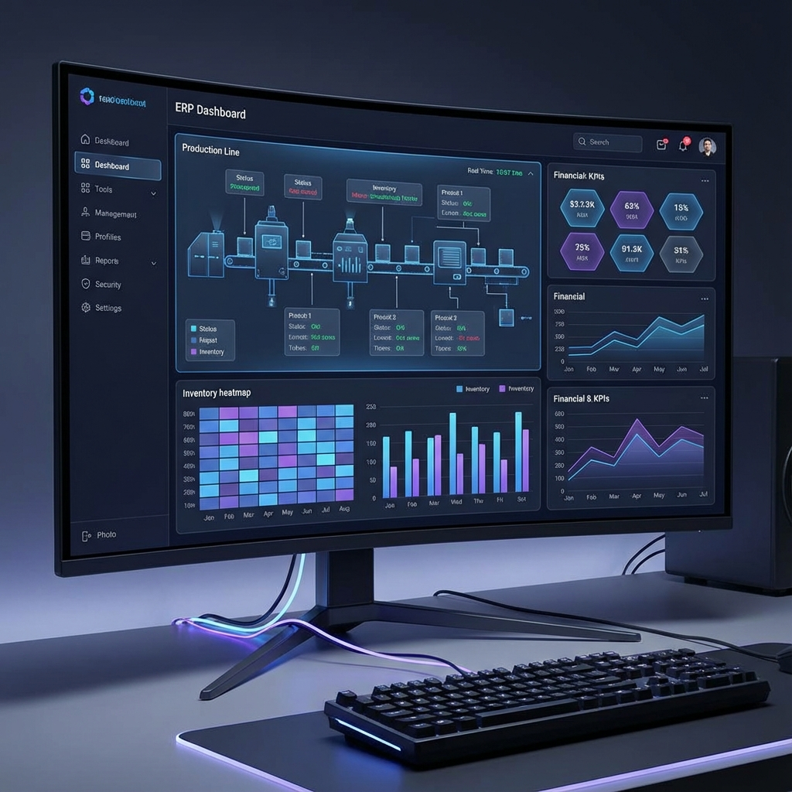

# Systems Engineer Portfolio 🚀

A modern, high-performance, and static portfolio website designed for a **Systems Engineer & Automation Specialist**. Built with modular JavaScript and Tailwind CSS, focused on showcasing complex enterprise systems, infrastructure capabilities, and hardware-software integration.



## 🌟 Key Features

- **Static Architecture**: Pure HTML/JS/CSS structure. No backend required. Blazing fast load times.
- **Modular Content**: All data (profile, projects, experience) is separated in `assets/js/data.js` for easy updates.
- **Modern UI/UX**:
  - Glassmorphism design elements.
  - Fully responsive (Mobile First).
  - **Dark Mode** support (System preference + Toggle).
  - Smooth ScrollSpy navigation.
- **Professional Showcase**:
  - **Featured Projects**: High-impact visual section for top-tier work (ERP, WMS, Compliance).
  - **Detailed Experience**: Timeline view of professional history.
  - **3D Profile Avatar**: Integrated pulse animation for a tech-savvy feel.

## 🛠️ Technology Stack

- **Core**: Semantic HTML5, Vanilla JavaScript (ES Modules).
- **Styling**: [Tailwind CSS](https://tailwindcss.com/) (CDN for development/simplicity).
- **Fonts**: [Outfit](https://fonts.google.com/specimen/Outfit) (Google Fonts).
- **Icons**: Heroicons (SVG).
- **Deployment**: GitHub Pages.

## 📂 Project Structure

```bash
.
├── index.html          # Main portfolio page
├── projects.html       # Full project list page
├── README.md           # Documentation
└── assets
    ├── img             # Images (Profile, Showcase screenshots)
    └── js
        ├── data.js       # [CONTENT] Edit this file to update text/data
        ├── main.js       # [LOGIC] Theme, Scroll, Mobile Menu
        └── components.js # [UI] Reusable Header & Footer renderers
```

## 🚀 Getting Started

### Prerequisites

- A modern web browser (Chrome, Edge, Firefox, Safari).
- A code editor (VS Code recommended).
- Git (for version control).

### Installation

1.  **Clone the repository**

    ```bash
    git clone https://github.com/devohme-id/devohme-id.github.io.git
    cd devohme-id.github.io
    ```

2.  **Run Locally**
    - **VS Code**: Install the "Live Server" extension -> Right-click `index.html` -> "Open with Live Server".
    - **Python**: `python3 -m http.server 8000`
    - **Node**: `npx serve .`

## 📝 How to Update Content

You do **not** need to touch the HTML files to update your resume information.

1.  Open `assets/js/data.js`.
2.  Update the objects/arrays:
    - `profile`: Name, Title, Contact Info.
    - `showcase`: The featured top 3 projects (Hero images).
    - `experiences`: Work history.
    - `projects`: The detailed table of all developed systems.
    - `skills`: Technical skill tags.
3.  Save the file. The changes will reflect immediately.

## 📦 Deployment

This project is configured for **GitHub Pages**.

1.  Commit your changes:
    ```bash
    git add .
    git commit -m "Update portfolio content"
    ```
2.  Push to the main branch:
    ```bash
    git push origin main
    ```
3.  Visit your live site at `https://devohme-id.github.io`.

## 📜 License

© 2025 Roby Kornela. All Rights Reserved.
Designed with professionalism and impact.
